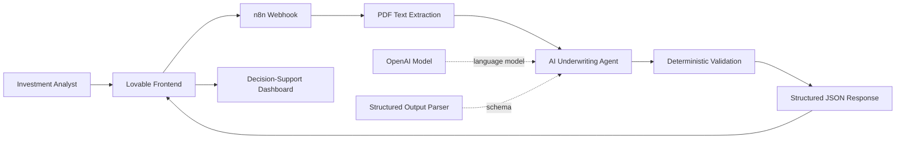

# DealScreen AI

> AI-assisted industrial real estate deal screening that turns an Offering Memorandum into a structured, reviewable underwriting brief.

[](https://github.com/Mandeep-Khatri/dealscreen-ai)
[](https://industrial-dealscreen.lovable.app)
[](./n8n/industrial-deal-screening-workflow.json)
[](./docs/N8N_WORKFLOW_ARCHITECTURE.md)

**Live Demo:** https://industrial-dealscreen.lovable.app

DealScreen AI is a decision-support prototype for industrial commercial real estate underwriting. It extracts property and market facts from an Offering Memorandum, separates subject-property data from market data, evaluates key investment risks, identifies missing underwriting inputs, and returns a structured recommendation for human review.

---

## Why This Project Exists

Industrial deal screening is often repetitive and fragmented. An analyst may need to read a long OM, copy physical specifications into a model, separate market statistics from subject-property facts, identify missing financial data, compare risks, and prepare a first-pass recommendation before deeper underwriting can begin.

DealScreen AI automates that first screening pass while intentionally refusing to invent missing numbers.

### Core objective

**Reduce document-review time without reducing underwriting discipline.**

The system is designed to answer questions such as:

- What are the key physical characteristics of the asset?
- Is the property occupied or vacant?
- Which core financial fields are actually present in the OM?
- How does the subject compare with the broader market and local submarket?
- Which required risk categories are evaluable?
- Are there contradictions inside the document?
- What information is still required before an investment decision can be made?

---

## Product Demo

The deployed Lovable interface presents the analysis as an investment-screening dashboard.

**Try it:** https://industrial-dealscreen.lovable.app

The current prototype supports views for:

- Investment recommendation
- Property fundamentals
- Financial underwriting readiness
- Market and submarket intelligence
- Investment risk analysis
- Missing critical information
- Strengths, weaknesses, opportunities, and due diligence
- Investment thesis and recommended investor profile
- Structured JSON download / export workflow

### Prototype case study

The project has been tested against an industrial property at **8640 Slauson Avenue, Pico Rivera, CA 90660**.

| Extracted field | Prototype result |
|---|---:|
| Building size | 65,014 SF |
| Occupancy | 0% |
| Clear height | 18 ft |
| Dock-high doors | 10 |
| Ground-level doors | 1 |
| Parking | 89 spaces |
| Power | 1,200 amps |
| Year built | 1960 |
| Year renovated | 2024 |

For this case, the engine returns **`INSUFFICIENT_DATA`** because the OM does not provide enough verified financial information to complete reliable valuation analysis. That is intentional behavior: missing purchase price, NOI, subject rent, or cap-rate inputs remain missing rather than being fabricated.

---

## Architecture



The design deliberately combines **AI reasoning** with **schema enforcement** and **deterministic post-processing** instead of relying on a single free-form model response.

### Processing pipeline

1. **Webhook intake** - receives the uploaded deal document.
2. **PDF extraction** - extracts source text for analysis.
3. **AI underwriting agent** - performs industrial CRE extraction and investment screening.
4. **Structured output parser** - forces the response into a defined JSON contract.
5. **Deterministic validation** - checks required risk categories, financial-data availability, calculated metrics, risk consistency, and recommendation validity.
6. **Frontend presentation** - renders results in a reviewable underwriting dashboard.

More detail:

- [System architecture](./docs/ARCHITECTURE.md)
- [n8n workflow architecture](./docs/N8N_WORKFLOW_ARCHITECTURE.md)
- [Lovable frontend](./docs/LOVABLE_FRONTEND.md)
- [Decision engine](./docs/DECISION_ENGINE.md)
- [Demo walkthrough](./docs/DEMO_WALKTHROUGH.md)

---

## Structured Output

The core AI contract includes:

```json
{
  "property": {},
  "financials": {},
  "market": {},
  "risk_flags": [],
  "validation_warnings": [],
  "missing_critical_information": [],
  "investment_analysis": {}
}
```

The deterministic validation node then adds calculated metrics and rule-based validation results before returning the final response.

---

## Required Risk Framework

The screening engine explicitly evaluates five required categories:

| Risk category | Evaluation rule |
|---|---|
| Rent PSF vs Market | Evaluate only when subject rent is actually available |
| Cap Rate | Evaluate only when verified inputs support it |
| Clear Height | Evaluate the subject's stated clear height and functional implications |
| Vacancy | Evaluate subject occupancy/vacancy and lease-up exposure |
| Price/SF vs Comparable Market Data | Evaluate only when subject pricing is available |

If a category cannot be evaluated from the source document, the workflow uses **`not_evaluable`** and explains what information is missing.

---

## Reliability & Hallucination Guardrails

A core design goal is to make the system conservative when the source document is incomplete.

### Extraction guardrails

- Never invent missing numeric values.
- Return `null` when a requested fact is absent.
- Preserve subject-property data separately from market and submarket data.
- Do not substitute market rent for subject rent.
- Do not fabricate purchase price, NOI, price/SF, or cap rate.
- Do not create hypothetical tenant income for a vacant asset.

### Cross-document validation

The workflow is instructed to compare facts across the OM and surface contradictory statements in `validation_warnings` rather than silently choosing one.

### Structured schema

The model output is constrained to a defined JSON schema for property, financials, market data, risk flags, validation warnings, missing information, and investment analysis.

### Deterministic validation

A JavaScript validation node independently checks items including:

- Presence of all five required risk categories
- Financial-field completeness
- Subject vacancy calculation
- Price/SF calculability
- Cap-rate calculability
- Consistency of non-evaluable rent and cap-rate risks
- Recommendation validity

This creates a second validation layer after the LLM response.

---

## Recommendation Framework

The investment recommendation is constrained to one of five values:

```text
BUY
CONSIDER
REVIEW
PASS
INSUFFICIENT_DATA
```

The system is not allowed to issue a confident recommendation simply because the property has attractive physical characteristics. When critical financial inputs prevent reliable underwriting, it can return `REVIEW` or `INSUFFICIENT_DATA` instead.

---

## Technology Stack

| Layer | Technology | Role |
|---|---|---|
| Frontend | Lovable | Analyst-facing screening dashboard |
| Workflow orchestration | n8n | Document intake, AI orchestration, validation, response |
| AI | OpenAI model via n8n | Extraction and underwriting analysis |
| Output control | Structured Output Parser | JSON schema enforcement |
| Validation | JavaScript / n8n Code node | Deterministic checks and calculations |
| Integration | Webhook / JSON | Frontend-to-workflow communication |

---

## Repository Structure

```text
dealscreen-ai/
├── README.md
├── .gitignore
├── .env.example
├── docs/
│   ├── ARCHITECTURE.md
│   ├── N8N_WORKFLOW_ARCHITECTURE.md
│   ├── LOVABLE_FRONTEND.md
│   ├── DECISION_ENGINE.md
│   └── DEMO_WALKTHROUGH.md
├── n8n/
│   ├── README.md
│   └── industrial-deal-screening-workflow.json
└── sample-data/
    └── example-output.json
```

---

## Run the Public Workflow Template

The repository contains a **sanitized public n8n workflow template**. Credential references and instance-specific metadata are intentionally excluded.

1. Clone the repository.
2. Open n8n.
3. Import `n8n/industrial-deal-screening-workflow.json`.
4. Configure your own OpenAI credential in the OpenAI Chat Model node.
5. Review the webhook path and security settings for your environment.
6. Activate the workflow only after configuration is complete.
7. Send a PDF Offering Memorandum to the webhook using your own frontend or API client.

> The public workflow is intentionally safe to share and does not contain production credentials, private webhook secrets, or confidential Offering Memoranda.

---

## Security & Data Handling

Never commit:

- API keys or access tokens
- `.env` files containing secrets
- n8n credential objects
- private webhook authentication values
- confidential Offering Memoranda
- proprietary market-data exports
- personally identifiable or restricted deal information

The workflow committed here is a public-safe version intended for demonstration and review.

---

## Current Limitations

This is a screening prototype, not a complete acquisition underwriting platform. The current project does not claim to replace:

- Full cash-flow modeling
- Legal, title, environmental, engineering, or zoning review
- Third-party market-data verification
- Investment committee approval
- Professional investment judgment

The Lovable frontend is deployed separately; this repository currently focuses on the workflow, architecture, validation logic, sample output, and product documentation.

---

## Roadmap

- Source-level citations for extracted facts
- Automated lease and sale comparable ingestion
- Sensitivity and scenario analysis
- Debt / financing analysis
- Configurable investment criteria and scoring
- Excel underwriting export
- Investment committee memo generation
- Persistent deal history and comparison dashboard
- Automated QA tests for workflow outputs

---

## Project Status

**Prototype / hackathon portfolio project.**

DealScreen AI demonstrates how a human-in-the-loop AI workflow can accelerate industrial real estate screening while preserving conservative underwriting behavior when the source material is incomplete.

## Disclaimer

DealScreen AI is a decision-support prototype. All outputs should be independently verified before being used for investment, lending, legal, environmental, or other professional decisions.
