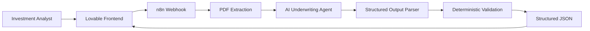
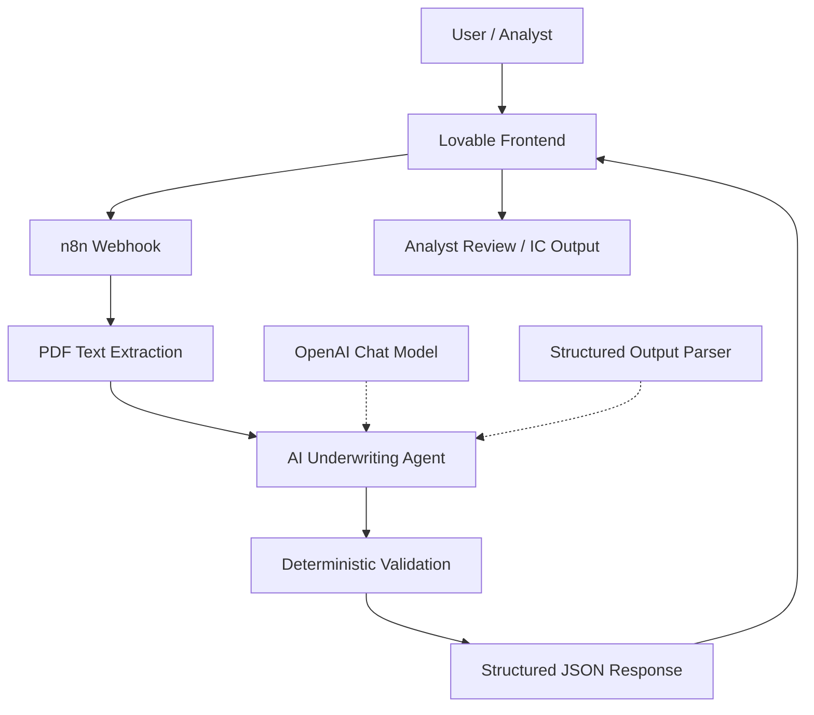

# DealScreen AI

**AI-powered industrial real estate deal screening and underwriting assistant.**

**Live Demo:** https://industrial-dealscreen.lovable.app

DealScreen AI helps investment teams review industrial real estate opportunities faster by turning offering memorandums and market inputs into structured property data, financial insights, market context, validation checks, and risk flags.

## Problem

Industrial real estate underwriting is often manual and fragmented. Analysts must review long offering memorandums, extract property and financial information, compare market data, identify missing assumptions, and assess risk before a deal can move forward.

## Solution

DealScreen AI creates an automated first-pass screening workflow that:

1. Ingests deal documents and property information.
2. Extracts key property, tenant, lease, and financial data.
3. Organizes market indicators and comparable information.
4. Evaluates investment and operating risks.
5. Validates extracted information and flags missing data.
6. Returns structured output for a human analyst to review.

## Product Flow



## Key Features

- Offering Memorandum review and structured extraction
- Property and building data extraction
- Financial information screening
- Market vacancy, rent, supply, and absorption analysis
- Risk flag generation
- Missing-data and assumption validation
- Structured JSON output for downstream applications
- Human-in-the-loop review
- n8n workflow automation
- Lovable analyst-facing dashboard
- JSON download / export workflow
- Investment committee reporting interface

## Live Frontend

The DealScreen AI frontend is built in Lovable and is available at:

**https://industrial-dealscreen.lovable.app**

The prototype presents:

- Property and recommendation summary
- Financial underwriting
- Investment risk analysis
- Market intelligence
- Underwriting readiness / missing information
- New Analysis
- Download JSON
- Export
- IC Report

See [`docs/LOVABLE_FRONTEND.md`](docs/LOVABLE_FRONTEND.md) for the frontend architecture and user flow.

## Example Property

The prototype workflow has been tested with an industrial property at **8640 Slauson Avenue, Pico Rivera, California**.

Example extracted fields include:

- Building size: 65,014 SF
- Occupancy: 0%
- Clear height: 18 ft
- Dock-high doors: 10
- Ground-level doors: 1
- Parking: 89 spaces
- Power: 1,200 amps
- Year built: 1960
- Renovated: 2024

The system is designed to mark missing financial inputs as unavailable rather than inventing values.

## Structured Output

The AI workflow returns structured underwriting data including:

```json
{
  "property": {},
  "financials": {},
  "market": {},
  "risk_flags": [],
  "validation_warnings": [],
  "missing_critical_information": [],
  "investment_analysis": {},
  "calculated_metrics": {},
  "deterministic_validation": {}
}
```

### Reliability Rules

DealScreen AI follows several important validation rules:

- Never guess missing values.
- Preserve original units when possible.
- Keep subject-property and market statistics separate.
- Do not use market rent as subject rent.
- Do not fabricate purchase price, NOI, or cap rate.
- Mark non-evaluable risks when required information is unavailable.
- Surface validation warnings and unusual assumptions.
- Run deterministic checks after the AI analysis.
- Keep AI output reviewable by a human analyst.

## Architecture



Detailed architecture:

- [`docs/ARCHITECTURE.md`](docs/ARCHITECTURE.md)
- [`docs/N8N_WORKFLOW_ARCHITECTURE.md`](docs/N8N_WORKFLOW_ARCHITECTURE.md)
- [`docs/LOVABLE_FRONTEND.md`](docs/LOVABLE_FRONTEND.md)

## Technology

- **Frontend:** Lovable
- **Workflow automation / backend orchestration:** n8n
- **AI layer:** OpenAI language model based extraction and analysis
- **Validation:** Structured Output Parser + deterministic JavaScript checks
- **Integration:** Webhooks / APIs
- **Data format:** JSON
- **Architecture:** AI-assisted underwriting with human review

## Repository Structure

```text
dealscreen-ai/
├── README.md
├── .gitignore
├── .env.example
├── docs/
│   ├── ARCHITECTURE.md
│   ├── N8N_WORKFLOW_ARCHITECTURE.md
│   └── LOVABLE_FRONTEND.md
├── n8n/
│   ├── README.md
│   └── industrial-deal-screening-workflow.json
└── sample-data/
    └── example-output.json
```

## Security

Do not commit:

- API keys
- `.env` files
- passwords or credentials
- private webhook secrets
- confidential offering memorandums
- proprietary market data

Use `.env.example` to document required configuration without exposing secrets.

## Project Status

This repository contains the prototype architecture and workflow for an AI-powered industrial real estate fellowship / hackathon project. The system is being developed as a decision-support tool, not as a replacement for professional investment judgment.

## Future Improvements

- Automated rent and sales comparable collection
- Sensitivity analysis and scenario modeling
- Debt and financing analysis
- Investment scoring
- Source-level citations for every extracted field
- Export to Excel and expanded investment committee memo formats

## Disclaimer

DealScreen AI is a prototype decision-support system. Outputs should be independently verified before being used for investment decisions.
