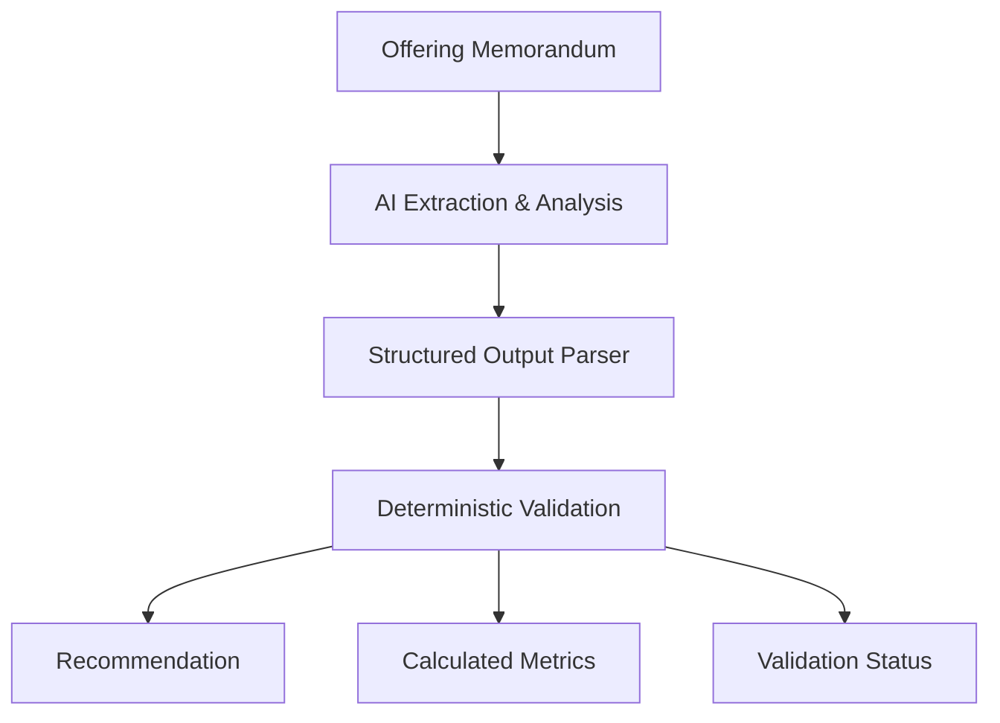

# Decision Engine

DealScreen AI is designed as a **conservative screening engine**, not a free-form chatbot. The workflow combines LLM-based document analysis with explicit schema constraints and deterministic checks.

## Decision Layers



## 1. AI Extraction Layer

The AI agent is responsible for:

- Extracting subject-property facts
- Extracting explicitly stated financial information
- Separating market and submarket statistics
- Evaluating industrial real estate risks
- Identifying internal inconsistencies
- Producing strengths, weaknesses, opportunities, due diligence items, investment thesis, investor profile, and recommendation

The prompt explicitly instructs the model not to invent missing numeric values.

## 2. Structured Output Layer

The Structured Output Parser requires a fixed JSON schema for:

- `property`
- `financials`
- `market`
- `risk_flags`
- `validation_warnings`
- `missing_critical_information`
- `investment_analysis`

This makes the response predictable for the frontend and downstream integrations.

## 3. Deterministic Validation Layer

The n8n Code node performs rule-based checks after AI analysis.

### Required risk categories

The response must contain:

1. Rent PSF vs Market
2. Cap Rate
3. Clear Height
4. Vacancy
5. Price/SF vs Comparable Market Data

### Financial completeness

The validator counts availability of five core fields:

- Purchase price
- Price/SF
- Subject rent PSF
- Stabilized NOI
- Cap rate

### Calculated metrics

When verified inputs exist, the deterministic layer can calculate:

**Subject vacancy**

```text
100 - occupancy_percent
```

**Price per SF**

```text
purchase_price / building_size_sf
```

**Cap rate**

```text
(stabilized_noi / purchase_price) * 100
```

If required inputs are absent, the calculated metric remains unavailable.

### Consistency checks

The validation node checks that:

- Missing subject rent produces a `not_evaluable` Rent PSF vs Market risk.
- Missing NOI or purchase price produces a `not_evaluable` Cap Rate risk.
- The final recommendation belongs to the approved recommendation set.

## Recommendation Set

The system constrains recommendations to:

- `BUY`
- `CONSIDER`
- `REVIEW`
- `PASS`
- `INSUFFICIENT_DATA`

`INSUFFICIENT_DATA` is a valid outcome and is intentionally used when the source document lacks enough financial information to support reliable underwriting.

## Why This Architecture Matters

A single LLM response can be persuasive even when the input document is incomplete. DealScreen AI reduces that risk by adding controls around the model:

```text
Source Document
      ↓
AI Reasoning
      ↓
Schema Enforcement
      ↓
Deterministic Checks
      ↓
Human Review
```

The workflow therefore treats AI as an analyst assistant whose output must pass both structural and rule-based validation before it reaches the decision dashboard.
