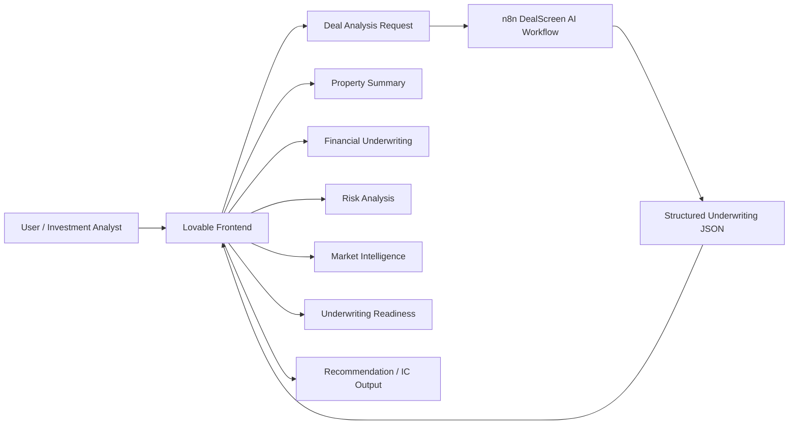
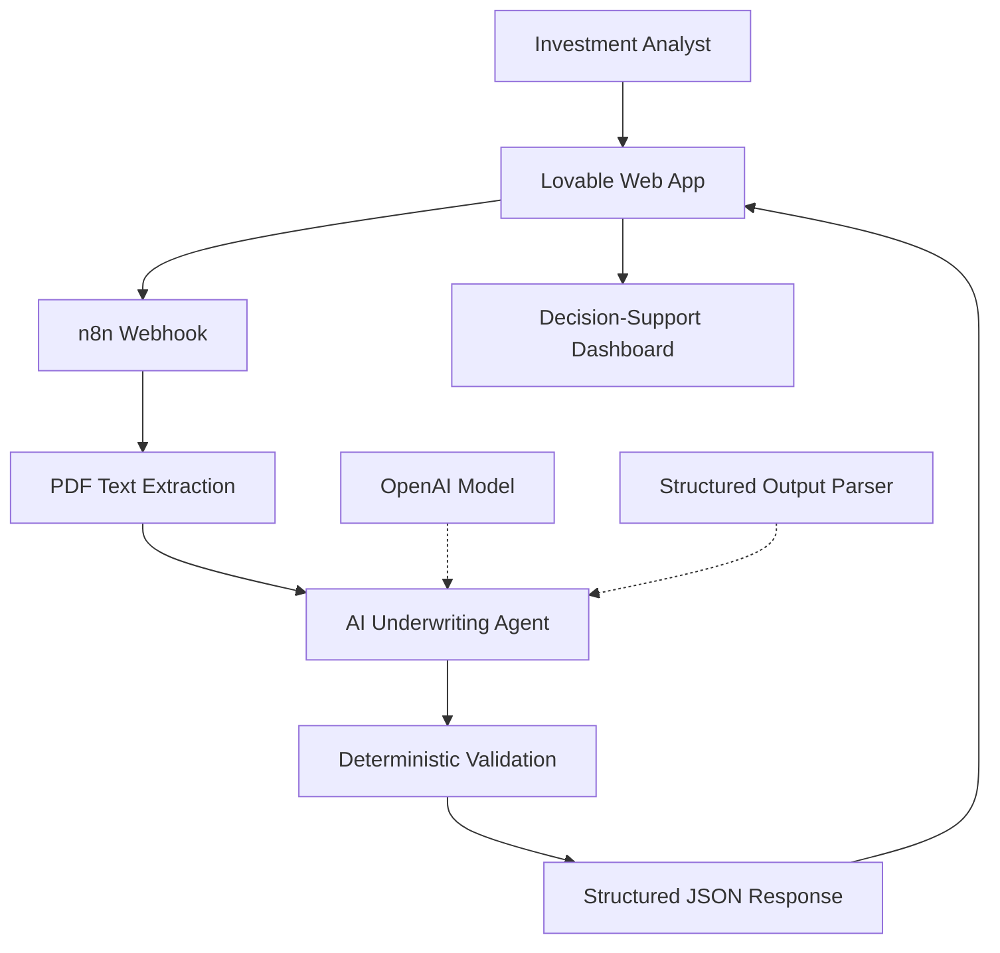

# Lovable Frontend

## Live Demo

**DealScreen AI — Industrial CRE Investment Screening**

https://industrial-dealscreen.lovable.app

The Lovable frontend presents the structured underwriting output from the DealScreen AI workflow in an analyst-friendly interface.

## Demonstrated Interface

The current prototype includes top-level actions for:

- **New Analysis**
- **Download JSON**
- **Export**
- **IC Report**

## Result Views

The demonstrated DealScreen AI results organize underwriting information into clear decision-support sections.

### Property / Recommendation

The interface presents the analyzed property together with the investment recommendation and supporting explanation.

For the prototype property at **8640 Slauson Avenue, Pico Rivera, CA 90660**, the workflow returns **INSUFFICIENT_DATA** when critical financial information required for valuation is unavailable.

### Financial Underwriting

The frontend displays core underwriting fields including:

- Purchase price
- Price / SF
- Subject rent / SF
- Stabilized NOI
- Cap rate

When these values are not contained in the Offering Memorandum, the interface shows them as **Not Provided** instead of estimating them.

### Investment Risk Analysis

The screening output presents the required industrial real estate risk categories and their severity / evaluability.

The core risk categories are:

1. Rent PSF vs Market
2. Cap Rate
3. Clear Height
4. Vacancy
5. Price/SF vs Comparable Market Data

### Market Intelligence

The market section benchmarks the subject property against broader market and local submarket information.

The prototype distinguishes:

- Central Los Angeles market data
- Pico Rivera submarket data
- Subject-property occupancy

This separation prevents market statistics from being incorrectly presented as subject-property facts.

### Underwriting Readiness

The interface surfaces missing critical information so the analyst can see what is still required before a reliable investment decision can be made.

Examples include missing pricing, NOI, operating expenses, rent roll, and other underwriting inputs when they are absent from the source document.

## Frontend Role in the Architecture

## Full Product Architecture

## Design Principle

The frontend is designed as a **decision-support interface**, not an autonomous investment approval system. Missing information is surfaced explicitly and AI-generated results remain reviewable by a human analyst.

## Related Files

- [`N8N_WORKFLOW_ARCHITECTURE.md`](./N8N_WORKFLOW_ARCHITECTURE.md)
- [`ARCHITECTURE.md`](./ARCHITECTURE.md)
- [`../n8n/industrial-deal-screening-workflow.json`](../n8n/industrial-deal-screening-workflow.json)
