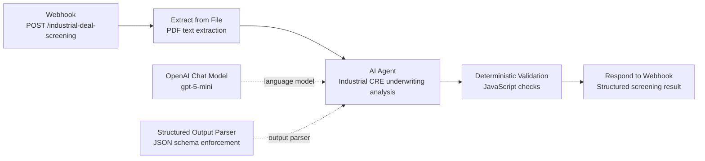
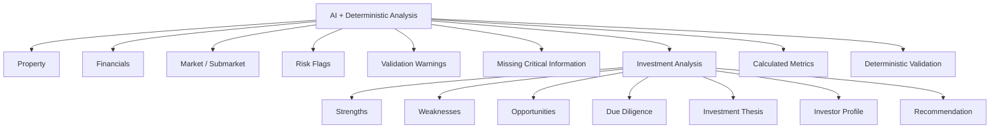

# n8n Workflow Architecture

This diagram represents the DealScreen AI workflow implemented in n8n.

## Processing Flow

1. **Webhook** receives the uploaded deal document through a POST request.
2. **Extract from File** converts the PDF into text for analysis.
3. **AI Agent** reviews the Offering Memorandum as an industrial real estate underwriting analyst.
4. **OpenAI Chat Model** provides the language-model reasoning used by the AI Agent.
5. **Structured Output Parser** forces the model response into the required JSON schema.
6. **Deterministic Validation** performs rule-based checks after the AI response, including required risk categories, financial-data availability, vacancy calculation, price/SF calculation, cap-rate calculation, risk consistency, and recommendation validation.
7. **Respond to Webhook** returns the final structured result to the calling application.

## Output Architecture

## Required Risk Categories

The workflow requires analysis of these five hackathon risk categories:

- Rent PSF vs Market
- Cap Rate
- Clear Height
- Vacancy
- Price/SF vs Comparable Market Data

When required information is missing, the system uses `not_evaluable` instead of inventing values.

## Reliability Guardrails

- Do not guess missing numeric values.
- Keep subject-property and market data separate.
- Do not use market rent as subject rent.
- Do not fabricate purchase price, NOI, or cap rate.
- Flag conflicting information found across the OM.
- Run deterministic rule-based checks after AI analysis.
- Keep the final output structured for downstream applications and human review.
