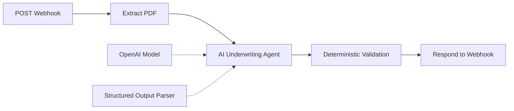

# n8n Backend Workflow

This folder contains the public-safe DealScreen AI workflow used for document ingestion, AI underwriting analysis, structured output enforcement, deterministic validation, and webhook response handling.

## Workflow

## File

`industrial-deal-screening-workflow.json`

The committed workflow is a **sanitized public export**. Production credential references and instance-specific metadata are intentionally removed.

## Import Into n8n

1. Open your n8n workspace.
2. Import `industrial-deal-screening-workflow.json`.
3. Open the **OpenAI Chat Model** node.
4. Add your own OpenAI credential.
5. Review the webhook configuration for your environment.
6. Keep the workflow inactive until credentials and security settings are configured.
7. Activate and test with a non-confidential Offering Memorandum.

## Workflow Responsibilities

### Webhook

Accepts the deal-analysis request using the `industrial-deal-screening` path.

### Extract from File

Extracts text from the uploaded PDF.

### AI Agent

Performs industrial CRE underwriting analysis with explicit guardrails against invented financial values and subject/market data mixing.

### Structured Output Parser

Enforces a fixed JSON schema for:

- Property
- Financials
- Market / submarket data
- Risk flags
- Validation warnings
- Missing critical information
- Investment analysis

### Deterministic Validation

Runs rule-based JavaScript checks after the model response, including:

- Required risk-category coverage
- Core financial-field completeness
- Subject vacancy calculation
- Price/SF calculability
- Cap-rate calculability
- Risk consistency
- Recommendation validation

### Respond to Webhook

Returns the structured output for the calling frontend or API client.

## Required Risk Categories

The workflow requires these five categories:

1. Rent PSF vs Market
2. Cap Rate
3. Clear Height
4. Vacancy
5. Price/SF vs Comparable Market Data

When the source document lacks enough information, risks should be returned as `not_evaluable` rather than supported by invented assumptions.

## Security

Do not commit a raw production export without reviewing it first. Remove:

- API keys
- Credential references
- Authentication secrets
- Private webhook URLs/tokens
- n8n instance metadata when not required
- Confidential Offering Memorandum content
- Proprietary market data

## Related Documentation

- [`../docs/N8N_WORKFLOW_ARCHITECTURE.md`](../docs/N8N_WORKFLOW_ARCHITECTURE.md)
- [`../docs/DECISION_ENGINE.md`](../docs/DECISION_ENGINE.md)
- [`../docs/DEMO_WALKTHROUGH.md`](../docs/DEMO_WALKTHROUGH.md)
